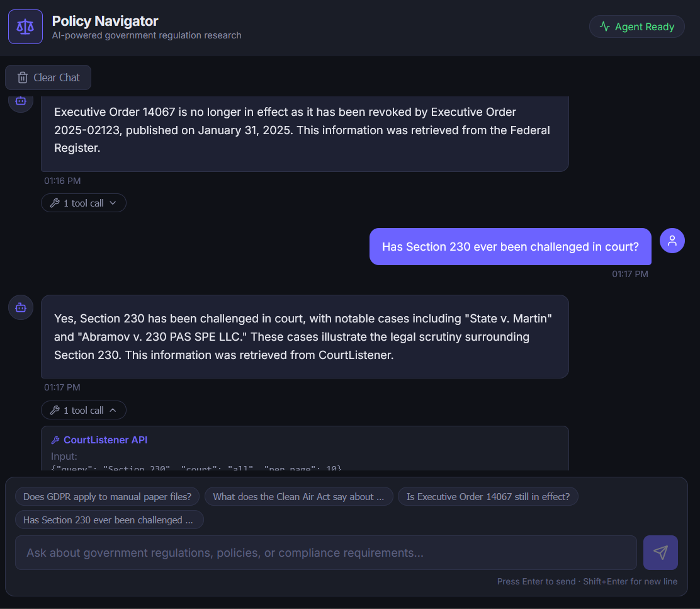

# Policy Navigator – Agentic RAG System for Government Regulation Search

A full-stack AI chatbot application that allows users to query and extract
insights from complex government regulations, compliance policies, and public
health guidelines. Built with **FastAPI**, **React + TypeScript + Vite**, and
the **aiXplain v2 SDK**.



---

## Purpose & Learning Objectives

This project demonstrates how to:

- Design and structure an **agentic RAG workflow** using the aiXplain v2 SDK
- Work with **unstructured policy data** (JSONL datasets, government websites)
- Integrate **custom Python tools** (Federal Register API, CourtListener API) via
  the aiXplain **Python Sandbox** integration
- Use the **aiXplain aiR** managed vector database for semantic document retrieval
- Deploy a practical, real-world AI agent with **explainable components**
  (intermediate tool call steps visible in the UI)

---

## Architecture

```
              ┌───────────────────────────────────────────┐
              │     Policy Navigator Agent (Unified)     │
              │       aix.Agent + Python Sandbox          │
              │                                           │
              │  Tools:                                   │
              │  • aiR Vector Index (policy documents)    │
              │  • Federal Register Search                │
              │  • Federal Register Document Detail        │
              │  • CourtListener Case Law Search           │
              └─────────────────────┬─────────────────────┘
                                    │
              ┌───────────┴───────────┐
              │   FastAPI Backend     │
              │  /api/chat            │
              │  /api/documents/...   │
              │  /api/status          │
              └───────────┬───────────┘
                          │
              ┌───────────┴───────────┐
              │   React + TypeScript  │
              │   Vite Frontend       │
              │   Chat UI             │
              └───────────────────────┘
```

### Agent & Tools

| Component | Type | Purpose |
|-----------|------|---------|
| **Policy Navigator** | Unified Agent (`aix.Agent`) | Routes questions to the right tool and synthesises answers |
| `search_federal_register` | Python Sandbox Tool | Queries Federal Register API for rules & executive orders |
| `get_federal_register_document` | Python Sandbox Tool | Fetches full document details by document number |
| `search_case_law` | Python Sandbox Tool | Queries CourtListener API for court opinions |
| aiR Vector Index | Managed Vector DB | aiR-backed index created via `aix.Tool(integration=...)` |

### Data Sources

| # | Source | Type | Content |
|---|--------|------|---------|
| 1 | [GDPR Articles – Kaggle](https://www.kaggle.com/datasets/josoriopt/gdpr-articles) | **Kaggle CSV dataset** | Full text of all 99 GDPR articles + recitals (data privacy regulation) |
| 2 | [WHO IHR topic overview](https://www.who.int/health-topics/international-health-regulations) | Website scrape | WHO IHR overview page |
| 3 | [EPA Clean Air Act](https://www.epa.gov/laws-regulations/summary-clean-air-act) | Website scrape | US environmental regulation summary |
---

## Prerequisites

- Python 3.10+
- Node.js 18+
- An [aiXplain account](https://console.aixplain.com/) and API key
- (Optional) A [CourtListener account](https://www.courtlistener.com/) for
  higher API rate limits

---

## Setup & Installation

### 1. Clone the repository

```bash
git clone <repo-url>
cd policy_rag_chatbot
```

### 2. Backend setup

Create a virtual environment and activate it:

**Windows (Command Prompt or PowerShell):**
```cmd
cd backend
python -m venv venv
venv\Scripts\activate
pip install -r requirements.txt
```

**Linux / macOS:**
```bash
cd backend
python3 -m venv venv
source venv/bin/activate
pip install -r requirements.txt
```

Copy `.env.example` to `.env` and set your API key:

**Windows:** `copy .env.example .env`  
**Linux / macOS:** `cp .env.example .env`

Then edit `.env` and set `AIXPLAIN_API_KEY` at minimum.

### 3. Download the Kaggle dataset

```bash
# Option A – Kaggle CLI (recommended)
pip install kaggle
kaggle datasets download -d josoriopt/gdpr-articles
# Unzip gdpr_articles.csv into backend/data/

# Option B – Manual download
# Visit https://www.kaggle.com/datasets/josoriopt/gdpr-articles
# Download and unzip gdpr_articles.csv into backend/data/
```

### 4. Index policy documents (first run only)

This creates an **aiR** (aiXplain Retrieval) managed vector index, ingests the
GDPR CSV dataset, and scrapes the WHO and EPA websites:

```bash
cd ..
python scripts/setup_index.py
```

After it completes, copy the printed `POLICY_INDEX_ID` into `backend/.env`.

### 5. Deploy the agent

```bash
python scripts/setup_agent.py
```

After it completes, copy the printed `AGENT_ID` into `backend/.env`.
On subsequent runs the backend will load the pre-deployed agent instead of
creating a new one each time.

### 6. Start the backend

```bash
cd backend
uvicorn app.main:app --reload --port 8000
```

### 7. Frontend setup

```bash
cd frontend
copy .env.example .env
npm install
npm run dev
```

Open [http://localhost:5173](http://localhost:5173) in your browser.

---

## Project Structure

```
policy_rag_chatbot/
├── backend/
│   ├── app/
│   │   ├── main.py                  # FastAPI application entry point
│   │   ├── config.py                # Environment variable management
│   │   ├── agents/
│   │   │   ├── policy_agent.py      # Unified agent definition
│   │   │   ├── tools.py             # Custom Python tools (Federal Register, CourtListener)
│   │   │   └── index_manager.py     # aiXplain vector index management
│   │   ├── routers/
│   │   │   ├── chat.py              # POST /api/chat, GET /api/status
│   │   │   └── documents.py         # POST /api/documents/upload & index-url
│   │   └── schemas/
│   │       └── models.py            # Pydantic request/response models
│   ├── data/
│   │   └── README.txt               # Data directory instructions
│   ├── requirements.txt
│   └── .env.example
├── frontend/
│   ├── src/
│   │   ├── api/client.ts            # Axios API client
│   │   ├── components/
│   │   │   ├── Header.tsx           # Top navigation bar with agent status
│   │   │   ├── ChatWindow.tsx       # Message list with welcome screen
│   │   │   ├── MessageBubble.tsx    # Individual message with step accordion
│   │   │   ├── ChatInput.tsx        # Text area + example question chips
│   │   ├── hooks/useChat.ts         # Chat state management hook
│   │   ├── types/index.ts           # TypeScript type definitions
│   │   ├── App.tsx                  # Root component
│   │   └── App.css                  # Dark-mode UI styles
│   ├── vite.config.ts
│   └── .env.example
├── scripts/
│   ├── setup_index.py               # Creates & seeds the vector index
│   └── setup_agent.py               # Creates & deploys the unified agent
├── .gitignore
└── README.md
```

---

## API Reference

### `POST /api/chat`

Send a message to the Policy Navigator agent.

**Request body:**
```json
{
  "message": "Is Executive Order 14067 still in effect?",
  "session_id": "optional-uuid"
}
```

**Response:**
```json
{
  "answer": "Yes, Executive Order 14067 is still in effect as of ...",
  "session_id": "uuid",
  "intermediate_steps": [
    {
      "tool": "search_federal_register",
      "input": "Executive Order 14067",
      "output": "{\"results\": [...]}"
    }
  ],
  "error": null
}
```

### `GET /api/status`

Returns agent readiness status.

### `POST /api/documents/upload`

Upload a PDF, TXT, MD, or CSV file to be indexed (multipart form).

### `POST /api/documents/index-url`

Index the content of a public URL.

**Request body:**
```json
{
  "url": "https://www.epa.gov/laws-regulations/summary-clean-air-act",
  "description": "EPA Clean Air Act summary"
}
```

---

## Example Queries

| User Question | Expected Behaviour |
|--------------|-------------------|
| "Is Executive Order 14067 still in effect?" | Queries Federal Register API → returns status + document details |
| "Has Section 230 ever been challenged in court?" | Queries CourtListener → returns case summaries |
| "Does GDPR apply to manual paper files?" | Searches vector index → returns GDPR regulations |
| "What does the Clean Air Act say about emission standards?" | Searches vector index + EPA website → returns standards |
| "What is GDPR and when does it apply?" | Searches vector index → returns GDPR overview |

---

## Environment Variables

### Backend (`backend/.env`)

| Variable | Required | Description |
|----------|----------|-------------|
| `AIXPLAIN_API_KEY` | **Yes** | Your aiXplain API key |
| `POLICY_INDEX_ID` | No | Reuse an existing vector index |
| `AGENT_ID` | No | Reuse an existing deployed agent |
| `DEFAULT_LLM_ID` | No | Override the default LLM (GPT-4o) |
| `COURT_LISTENER_TOKEN` | No | CourtListener API token (higher rate limits) |
| `ALLOWED_ORIGINS` | No | CORS origins (default: localhost:5173,3000) |
| `MAX_ITERATIONS` | No | Max agent reasoning steps (default: 10) |
| `MAX_TOKENS` | No | Max output tokens per agent run (default: 3072) |

### Frontend (`frontend/.env`)

| Variable | Required | Description |
|----------|----------|-------------|
| `VITE_API_URL` | No | Backend URL (default: http://localhost:8000) |

---

## Future Improvements

### i. Adding More Agents

- **Summarisation Agent** – Automatically generate executive summaries of
  lengthy regulatory documents. Could use an aiXplain pipeline with a
  summarisation model as a tool.
- **Compliance Checklist Agent** – Given a business type and jurisdiction,
  generate a tailored compliance checklist (e.g., HIPAA + GDPR for a health-
  tech startup operating in the EU and US).
- **Analytics & Trend Agent** – Track regulatory changes over time, identify
  which sectors are seeing increasing enforcement activity, and generate trend
  reports using the Federal Register publication history.
- **Regulatory Alert Agent** – Monitor the Federal Register for new rules
  relevant to a user's industry profile and proactively push notifications.

### ii. UI Improvements

- **Conversation history persistence** – Save chat sessions to localStorage or
  a backend database so users can revisit previous research.
- **Source citation cards** – Display retrieved document references as rich
  cards with title, agency, date, and a direct link rather than plain text.
- **Document viewer panel** – Side-by-side view: chat on the left, relevant
  document sections highlighted on the right.
- **Voice input / text-to-speech** – Allow users to speak their questions and
  hear responses read aloud using aiXplain's speech models.
- **Dark/light mode toggle** and **accessibility** improvements (ARIA labels,
  keyboard navigation).
- **Progressive Web App (PWA)** support for mobile-friendly offline access.

### iii. Additional Data Integrations

- **Kaggle policy datasets** – Index structured datasets from Kaggle (e.g.,
  privacy laws, climate policy, healthcare compliance) using the aiXplain CSV
  tool for structured data queries alongside the vector index.
- **Regulations.gov API** – Pull public comments and docket materials for
  proposed rules under active rulemaking.
- **OpenStates API** – Extend coverage to state-level legislation, enabling
  queries across all 50 US states.
- **EUR-Lex** – Index EU legislative acts (GDPR, AI Act, DSA) for European
  regulatory research.
- **WHO & CDC guidelines** – Index public health guidelines for healthcare
  compliance use cases.
- **Notion / Google Drive connector** – Allow organisations to index their
  internal policy wikis alongside public sources (similar to the
  `talk-to-your-files-agent` cookbook example).

### iv. Caching & Memory Features

- **Semantic response cache** – Cache agent answers for semantically similar
  queries to reduce API costs and latency (using Redis or a local vector store
  for cache lookup).
- **Conversation memory** – Maintain context across turns within a session
  so the agent can answer follow-up questions without re-explaining context
  (e.g., "Does it apply to non-profits?" after discussing GDPR).
- **Long-term user profiles** – Remember a user's industry, jurisdiction, and
  frequently asked topics to personalise responses and pre-load relevant index
  segments.
- **Incremental index updates** – Only re-index documents that have changed
  since the last run (content hash tracking), reducing setup time for large
  document collections.
- **Streaming responses** – Stream the agent's answer token-by-token to the
  frontend as it is generated, improving perceived responsiveness for long
  answers.

---

## References

- [aiXplain Documentation](https://docs.aixplain.com/)
- [aiXplain SDK Cookbook](https://github.com/aixplain/cookbook/tree/main/tutorials)
- [Build an Agentic RAG – aiXplain Tutorial](https://docs.aixplain.com/tutorials/build-an-agentic-rag)
- [Federal Register API Documentation](https://www.federalregister.gov/developers/documentation/api/v1)
- [CourtListener REST API](https://www.courtlistener.com/help/api/rest/)
- [FastAPI Documentation](https://fastapi.tiangolo.com/)
- [Vite + React + TypeScript](https://vite.dev/guide/)
